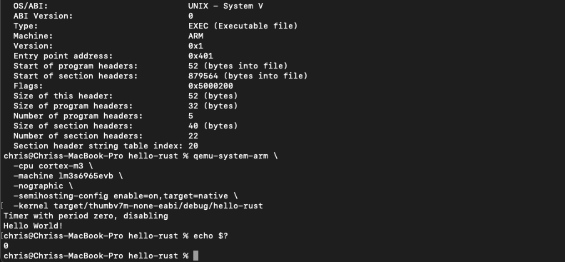

# Steps to run Rust cross compiled for ARM on qemu ARM emulator

Install qemu with brew
Install rustup from Rust website
Install cargo-binutils
    cargo install cargo-binutils
    rustup component add llvm-tools-preview
Run cargo install cargo-generate to install cargo-generate

Run cargo generate --git https://github.com/rust-embedded/cortex-m-quickstart
Used HelloRust for app name when prompted

cd hello-rust
edit src/main.rs (edited file in this repo)
Use semihosting to output to console

Run tail -n6 .cargo/config.toml to view target
Target is thumbv7m-none-eabi
Run rustup target add thumbv7m-none-eabi to add target to toolchain
Run cargo build to build

Run cargo readobj --bin hello-rust -- --file-headers to verify ARM executable

Run to have qemu run ARM executable on lm3s6965evb board
qemu-system-arm \                                                                
  -cpu cortex-m3 \
  -machine lm3s6965evb \
  -nographic \
  -semihosting-config enable=on,target=native \
  -kernel target/thumbv7m-none-eabi/debug/hello-rust

Run echo $? to verify exit code is 0 for successful exit.

